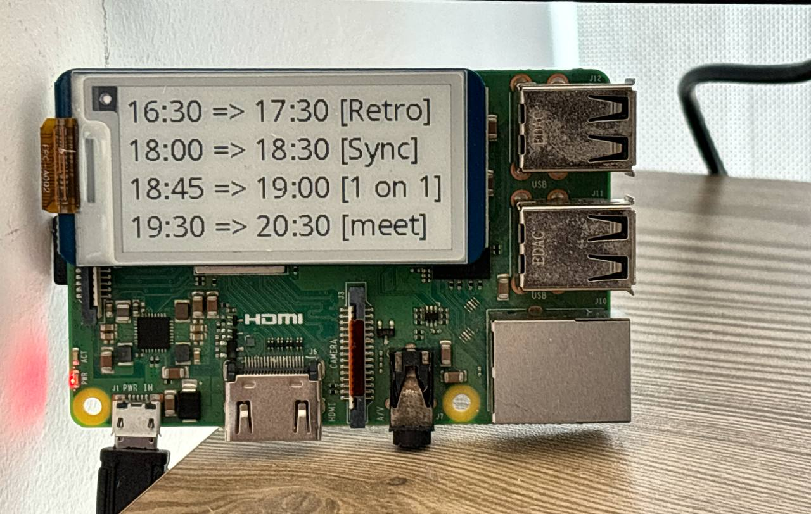

# DaySync
DaySync is a small e-ink display on your desk. It has only one purpose: show your upcoming events and meets from your Google Calendar.



## Device
Any standard Wi-Fi enabled [Raspberry Pi](https://a.co/d/06YPsAjF) 40PIN GPIO (tested on 3B+) and the [Waveshare 2.13 inch e-Paper Display Hat](https://a.co/d/0hyt380P).

## Getting Started
0. Clone the repo 
```
git clone https://github.com/ArmanJR/DaySync
cd DaySync
```
1. Go to your Google cloud console and create a project
2. Enable [Google Calendar API](https://console.cloud.google.com/marketplace/product/google/calendar-json.googleapis.com)
3. Create [OAuth Client](https://console.cloud.google.com/apis/credentials/oauthclient)
    - Application type: Web Application
    - Add `http://localhost:8999` to Authorized JavaScript origins and Authorized redirect URIs
    - Download the token, save it as `client_secret.json` alongside this repo's `main.py`
4. Add your account as a test user on [OAuth consent screen](https://console.cloud.google.com/apis/credentials/consent)
5. Create a virtual env 
```
python3 -m venv venv
```
6. Activate the env
```
source venv/bin/activate
```
7. Install the requirements
```
pip install -r requirements.txt
```

8. Modify `main.py` to your settings
   - Your timezone `tz = pytz.timezone('America/Toronto')`
   - The `calendarID` (more about calendars below)
   - `updateInterval` in seconds

9. Run the script to generate token
```
python main.py
```
A browser tab will open. Grant access to the app and close the browser after you did. A `token.json` file should exist now in the project directory.

10. Terminate the script (control+z) and run again via `nohup`
```
nohup python main.py > output.log 2>&1 &
```
If you want to terminate the script, just find the PID and kill
```
ps aux | grep main.py
```
```
user      12345  0.1  1.0  123456  12345 ?        S    10:00   0:00 python main.py
user      12346  0.0  0.0  123456   1234 pts/0    S+   10:00   0:00 grep --color=auto main.py
```
```
kill 12345
```
   
## Calendars
By default, your main calendar is called `primary`. You may want to import calendars from other accounts or sources.
To do so, [share your calendar](https://support.google.com/calendar/answer/37082?hl=en) and replace `calendarID` with the one you added.

## Improvements
- [ ] Replace `nohup` with a proper script execution

## Note
The waveshare files are copied from https://github.com/waveshareteam/e-Paper

## Contribution
Pull requests are welcome

## License
MIT